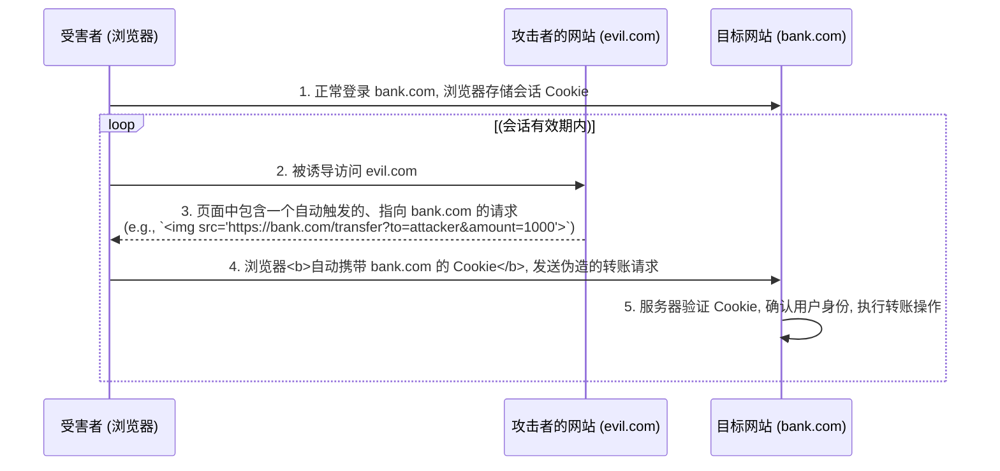

**跨站请求伪造 (Cross-Site Request Forgery, CSRF)** 是一种常见的 Web 安全漏洞，它允许攻击者诱导已认证的用户在他们当前登录的应用上执行非本意的操作。与 XSS 不同，CSRF 攻击并不窃取用户数据，而是**冒用用户的身份**来执行状态变更操作，如修改密码、发表评论或进行转账。

# CSRF 攻击的核心机制

CSRF 攻击的成立依赖于三个核心前提：

1. 用户已登录目标网站，并且浏览器中存有有效的会话凭据（通常是 Cookie）。
2. 用户在保持登录状态的同时，访问了一个由攻击者控制的恶意页面或点击了恶意链接。
3. 目标网站的后端仅依赖 Cookie 来验证用户身份，而没有额外的验证机制。

攻击者并不需要窃取用户的 Cookie。他们利用的是浏览器“自动携带 Cookie”的机制。



> [!warning] 攻击的隐蔽性
> CSRF 攻击可以完全在后台发生，无需任何 JavaScript。一个简单的 `` 标签、一个自动提交的 `<form>`，甚至是一个 CSS `background-image` 都可以成为触发伪造请求的载体。

# 纵深防御策略 (Defense in Depth)

防御 CSRF 需要采取多层次的策略，不能依赖单一的解决方案。

## SameSite Cookie 属性：浏览器的第一道防线

`SameSite` 是一个强大的 Cookie 属性，它直接指示浏览器在何种情况下可以携带 Cookie 进行跨站请求。这是从源头上遏制 CSRF 的最有效手段之一。

- **`SameSite=Strict`**: 最严格的模式。浏览器**仅在同站 (same-site)** 请求中发送 Cookie。即使用户从外部网站点击链接导航到目标网站，Cookie 也不会被发送。
- **`SameSite=Lax`** (现代浏览器默认值): 一个较为宽松的模式。允许在从外部网站发起的**顶层导航 (top-level navigations)** 且请求方法为“安全”的（如 `GET`）情况下发送 Cookie。它能有效防御跨站的 `POST` 表单提交等 CSRF 攻击，同时不影响常规的用户链接跳转体验。
- **`SameSite=None`**: 不做任何限制，允许在所有跨站请求中发送 Cookie。使用此值**必须同时设置 `Secure` 属性**。

> [!tip] Site vs. Origin 的区别
> - **同源 (Same-Origin)**: 要求**协议、完整域名、端口**三者完全一致。
> - **同站 (Same-Site)**: 规则更宽松，主要关注**顶级域名 + 二级域名**（eTLD+1）。例如，`store.example.com` 和 `my.example.com` 是跨源的，但它们是同站的。`SameSite` 属性正是基于“站”的定义来工作的。

## 反 CSRF 令牌 (Anti-CSRF Token)：服务器的核心验证

这是最经典、最可靠的服务器端防御机制，通常被称为**同步器令牌模式 (Synchronizer Token Pattern)**。机制如下：

1. 当用户访问一个需要保护的表单页面时，服务器生成一个唯一的、不可预测的、与当前用户会话绑定的**随机令牌**。
2. 服务器将此令牌嵌入到 HTML 表单的一个隐藏字段中。
3. 当用户提交表单时，这个令牌会随表单数据一起被发送回服务器。
4. 服务器在处理请求前，必须验证请求中包含的令牌是否与会话中存储的令牌匹配。

由于攻击者无法预测或获取到这个令牌，他们构造的伪造请求将因缺少合法令牌而被服务器拒绝。

```mermaid
sequenceDiagram
    participant Client as 客户端
    participant Server as 服务器

    Client->>Server: 1. 请求表单页面
    Server->>Server: 2. 生成唯一的 CSRF 令牌<br/>并存入用户会话
    Server-->>Client: 3. 返回 HTML, 表单中包含<br/>`<input type="hidden" name="_csrf" value="token123">`

    Client->>Server: 4. 提交表单 (包含 _csrf=token123)
    Server->>Server: 5. 比较提交的令牌与会话中的令牌
    
    alt 令牌匹配
        Server-->>Client: 6. 验证通过, 处理请求
    else 令牌不匹配
        Server-->>Client: 7. 验证失败, 拒绝请求 (403 Forbidden)
    end
```



> [!example] AJAX 请求中的 CSRF 令牌
> 对于使用 AJAX 提交数据的单页应用 (SPA)，令牌通常不放在表单中。一种常见的做法是，服务器在初始页面加载时，将令牌写入一个 `<meta>` 标签或一个全局 JavaScript 变量中。前端的 AJAX 请求逻辑则负责读取这个令牌，并将其作为一个自定义的 HTTP 请求头（如 `X-CSRF-Token`）发送。
> 
> ```html
> <meta name="csrf-token" content="your-unique-token-here">
> ```
> 
> ```js
> // 前端 JS 读取并发送
> const token = document.querySelector('meta[name="csrf-token"]').content;
> fetch('/api/update', {
>   method: 'POST',
>   headers: {
>     'X-CSRF-Token': token,
>     'Content-Type': 'application/json'
>   },
>   body: JSON.stringify({ /* ... */ })
> });
> ```

## 验证来源：辅助性防御

- **机制**: 在服务器端检查 HTTP 请求的 `Origin` 或 `Referer` 头，以验证请求是否来自预期的源。
- **局限性**: `Referer` 头可能因用户隐私设置而被省略，且在某些情况下可能被伪造。`Origin` 头相对更可靠，因为它由浏览器控制且通常不可伪造。虽然不能作为唯一的防御手段，但它可以作为一道有效的辅助防线。

