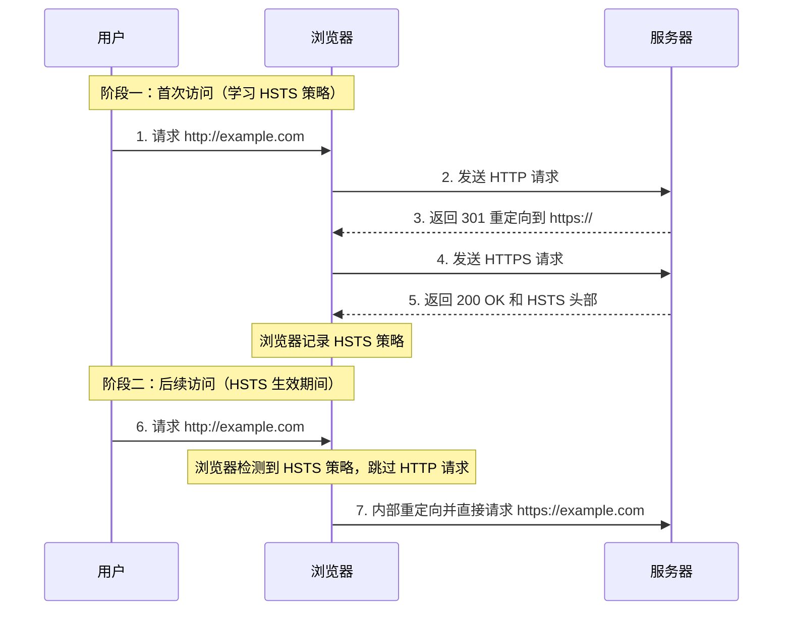

在现代 Web 中，全站 HTTPS 已是安全标配。然而，即使用户的最终访问是 HTTPS，其**第一次**尝试访问网站时，仍可能输入 `http://` 地址。服务器通过 301/302 重定向将其引导至 HTTPS，但这个初始的 HTTP 请求过程，仍然暴露在网络中，容易受到如 **SSL 剥离 (SSL Stripping)** 等中间人攻击。**HSTS (HTTP Strict Transport Security)** 是一种由服务器声明、由浏览器强制执行的安全策略，其核心目的就是从根本上消除这个不安全的首次连接，强制客户端只能通过 HTTPS 进行通信。

# HSTS 的工作流程：两阶段的“升级”

HSTS 的工作机制是一个“首次信任 (Trust on First Use)”并随后强制执行的过程，我们可以将其分为首次访问和后续访问两个阶段。

## 阶段一：首次访问 - 学习并记忆策略

当用户首次访问网站时（或在 HSTS 策略过期后），标准的重定向流程依然存在。

1. **用户请求 HTTP**: 用户在浏览器输入 `http://example.com`。
2. **服务器 301 重定向**: 服务器接收到 HTTP 请求后，返回一个状态码为 `301 Moved Permanently` (或 `302 Found`) 的响应，其 `Location` 头指向 `https://example.com`。
3. **浏览器跳转至 HTTPS**: 浏览器遵循重定向，向 `https://example.com` 发起新的请求。
4. **服务器下发 HSTS 策略**: 在对 HTTPS 请求的响应中，服务器加入一个关键的 HTTP 头：`Strict-Transport-Security`。

```http
Strict-Transport-Security: max-age=31536000; includeSubDomains
```

5. **浏览器记录策略**: 浏览器收到这个响应头后，会立即在内部的一个 HSTS 列表（“记忆”）中记录下：在接下来的 `max-age` 秒内，访问 `example.com` 及其所有子域名，都必须强制使用 HTTPS。
	- **`max-age`**: 策略的有效时长（以秒为单位）。每次浏览器收到这个头，都会刷新这个过期时间。
	- **`includeSubDomains`**: 一个可选指令，意味着此策略同样适用于该域名的所有子域名。

## 阶段二：后续访问 - 浏览器的内部强制跳转

一旦浏览器“记住”了某网站的 HSTS 策略，后续的访问行为将发生根本性改变。

> [!tip] **`307 Internal Redirect`**
> 当用户再次尝试用 `http://` 访问时，浏览器**不会发出任何网络请求**。它会直接在内部将 URL 从 `http` 修改为 `https`，然后才发起网络连接。在开发者工具的网络面板中，可以看到一个状态码为 `307 Internal Redirect` 的“伪请求”，它代表的就是这次由浏览器自身完成的、内存中的强制跳转。



# HSTS 预加载列表 (Preload List) - 弥补首次访问的漏洞

HSTS 的“首次信任”模型依然存在一个理论上的漏洞：第一次访问时的那个 `301` 重定向仍然可能被中间人攻击。为了解决这个问题，主流浏览器维护了一个**HSTS 预加载列表**。

这是一个硬编码在浏览器内部的域名列表。如果你的域名被加入了这个列表，那么即使用户是**有史以来第一次**访问你的网站，浏览器也会直接执行 `307 内部重定向`，从根本上消除了所有不安全的 HTTP 请求。

> [!example] 实践
> 1. 在 HSTS 头中加入 `preload` 指令： `Strict-Transport-Security: max-age=63072000; includeSubDomains; preload`
> 2. 通过 [hstspreload.org](https://hstspreload.org/) 提交域名，等待被各大浏览器厂商收录。这是一个不可逆的操作，需要审慎进行。

