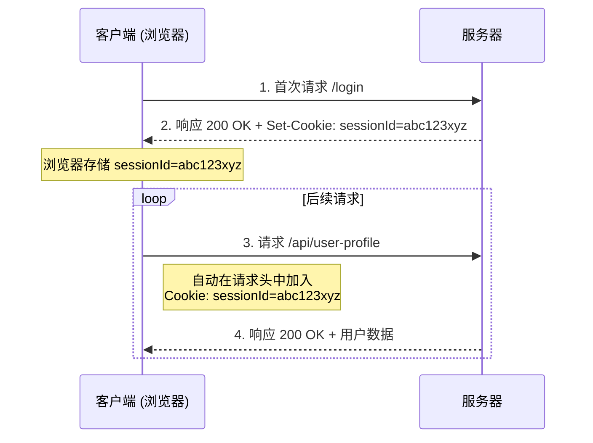
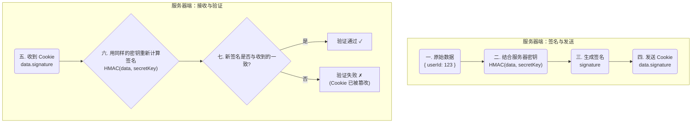

HTTP 协议本身是**无状态的 (stateless)**，这意味着服务器默认不会记录任何关于客户端先前请求的信息。为了在不同请求之间维持状态——例如用户的登录状态或购物车内容——浏览器与服务器之间需要一种机制来传递和识别信息。**HTTP Cookie** 正是为此而生的、由 RFC 6265 规范定义的标准机制。它允许服务器向客户端发送少量数据，客户端则会在后续的请求中将这些数据传回，从而实现一种“伪状态化”的会话，是现代 Web 应用功能实现的基础。

# Cookie 的核心工作机制

Cookie 的生命周期是一个简单的、自动化的客户端-服务器交互循环。

1. **服务器设置**: 当用户首次访问服务器时，服务器可以在 HTTP 响应中通过 `Set-Cookie` 头，向客户端（浏览器）下发一个或多个 Cookie。
2. **客户端存储**: 浏览器接收到 `Set-Cookie` 头后，会根据其中的指令（属性）将这些 `key=value` 格式的数据存储起来。
3. **客户端发送**: 在该 Cookie 过期之前，每当浏览器向同一服务器（满足 `Domain` 和 `Path` 属性）发起请求时，都会自动地在 HTTP 请求头中通过 `Cookie` 字段，将相关的 Cookie 数据一并发送过去。



# Cookie 属性 (Attributes) 深度解析

`Set-Cookie` 头不仅包含键值对，还可附带一系列“属性 (attributes)”，用于精细地控制 Cookie 的生命周期、作用域和安全性。

> [!example] `Set-Cookie` 头部示例
> ```http
> Set-Cookie: sessionId=abc123xyz; Max-Age=3600; Path=/; Domain=.example.com; Secure; HttpOnly; SameSite=Lax
> ```

## 生命周期控制 (Lifetime Control)

- **`Expires=<date>`**: 设置一个具体的 GMT 格式的**过期日期**。一旦到达该时间点，Cookie 将被浏览器删除。
- **`Max-Age=<seconds>`**: 设置一个以**秒**为单位的**生命时长**。`Max-Age` 的优先级高于 `Expires`。

> [!note] 持久性 Cookie vs. 会话期 Cookie
> - **持久性 Cookie (Persistent Cookie)**: 设置了 `Expires` 或 `Max-Age` 的 Cookie。它会被存储在用户的硬盘上，直到过期才被删除。
> - **会话期 Cookie (Session Cookie)**: 如果**不设置**任何过期属性，Cookie 将在当前会话结束时（通常是关闭浏览器时）被自动删除。

要**删除**一个 Cookie，标准的做法是服务器下发一个同名、同 `Path`、同 `Domain` 的 `Set-Cookie` 响应，并将其 `Expires` 设置为一个过去的时间，或将 `Max-Age` 设置为 `0` 或负数。

## 作用域控制 (Scope Control)

- **`Domain=<domain-value>`**: 指定了哪些域名可以接收此 Cookie。如果设置为 `.example.com`，则 `example.com` 及其所有子域名（如 `sub.example.com`）都会接收到它。
- **`Path=<path-value>`**: 指定了主机下的哪些路径可以接收此 Cookie。`Path=/`（默认值）表示该域名下的所有路径都可以接收。

## 安全性控制 (Security Control)

- **`Secure`**: 一个布尔标志。如果设置了此属性，浏览器将**只在 HTTPS 连接中**发送该 Cookie，在不安全的 HTTP 连接中则不会发送。
- **`HttpOnly`**: 一个布尔标志。如果设置了此属性，该 Cookie 将**无法通过客户端 JavaScript (`document.cookie`) 访问**。这是防御 XSS (跨站脚本攻击) 窃取会话 Cookie 的核心手段。
- **`SameSite=<Strict|Lax|None>`**: 这是防御 CSRF (跨站请求伪造) 攻击的关键属性。它定义了浏览器在跨站请求中应如何发送 Cookie。
    - **`Strict`**: 最严格。仅在**同站**请求中发送 Cookie。
    - **`Lax`**: （现代浏览器默认值）允许在从外部网站导航到目标网站的**顶层导航 GET 请求**中发送 Cookie，但在跨站的 `POST` 请求或 `iframe` 加载中则不会发送。
    - **`None`**: 允许在所有跨站请求中发送 Cookie。使用此值**必须同时设置 `Secure` 属性**。

# Cookie 的应用与安全实践

## 会话管理 (Session Management)

Cookie 最核心的用途是会话管理。服务器无需在 Cookie 中存储大量用户数据，而是遵循以下模式：

1. 用户登录成功后，服务器生成一个唯一的、不可预测的 **Session ID**。
2. 服务器将此 Session ID 作为 Cookie 值发送给客户端。
3. 服务器自身将 Session ID 与该用户的详细信息（如用户ID、权限等）关联起来，并存储在数据库或 Redis 等会话存储中。
4. 在后续请求中，浏览器只需携带这个小小的 Session ID，服务器便可通过它查询到完整的用户会话信息。

> [!warning] 存储内容的原则
> **永远不要**在 Cookie 中直接存储如用户密码、信用卡号等高度敏感的信息。Cookie 本质上是可被客户端访问和修改的，应始终将其视为一个不安全的“信使”，仅用于传递 Session ID 等无直接意义的标识符。

## 防篡改：Cookie 签名

为了防止客户端恶意篡改 Cookie 内容（例如，修改 `userId=123` 为 `userId=456`），服务器端可以对 Cookie 进行**签名 (Signing)**。



通过签名，即使 Cookie 的值是明文，服务器也能够有效地验证其**完整性 (Integrity)**，确保它没有在传输或客户端存储期间被篡改。