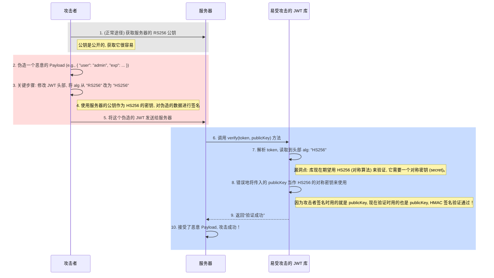

在现代 Web 架构，特别是分布式系统和单页应用 (SPA) 中，**JSON Web Token (JWT)** 已成为一种广泛采用的、用于在多方之间安全传递信息的开放标准 (RFC 7519)。它以一种紧凑且 URL 安全的方式，将认证和授权所需的信息自包含地封装在一个令牌中。这使得服务器可以实现**无状态 (stateless)** 的认证，极大地提升了系统的可扩展性。

# JWT 的解剖学：三段式结构

一个 JWT 本质上是一个由三部分组成的、经过 Base64Url 编码的字符串，各部分之间用点 `.` 分隔：**`Header.Payload.Signature`**

## 头部 (Header)

头部是一个 JSON 对象，通常包含两部分元数据：

- **`typ` (Type)**: 令牌的类型，对于 JWT 而言，其值固定为 `"JWT"`。
- **`alg` (Algorithm)**: 用于生成签名的算法，例如 `HS256` (HMAC using SHA-256) 或 `RS256` (RSA signature with SHA-256)。

```json
// Header 示例
{
  "alg": "HS256",
  "typ": "JWT"
}
```

此 JSON 对象经过 Base64Url 编码后，构成了 JWT 的第一部分。

## 载荷 (Payload)

载荷是 JWT 的核心，它包含了需要传递的实际数据，这些数据被称为**声明 (Claims)**。声明是一种键值对，用于安全地携带关于主体（通常是用户）和其他元数据的信息。

> [!note] 声明 (Claims) 的三种类型
> - **注册声明 (Registered Claims)**: 这是一组预定义的、推荐使用但非强制的声明，用于提供一套标准化的、可互操作的字段。例如：
> 	- `iss` (Issuer): 令牌的签发者。
> 	- `sub` (Subject): 令牌的主题（通常是用户的唯一标识符）。
> 	- `aud` (Audience): 令牌的接收者。
> 	- `exp` (Expiration Time): 令牌的过期时间戳。
> 	- `iat` (Issued At): 令牌的签发时间戳。
> - **公共声明 (Public Claims)**: 用户可以自定义声明，但为了避免冲突，建议在 `IANA JSON Web Token Registry` 中注册，或使用包含命名空间的 URI 来定义。
> - **私有声明 (Private Claims)**: 这是在通信双方之间自定义的、用于共享特定信息的声明，例如用户的角色、权限等。

```json
// Payload 示例
{
  "sub": "1234567890",
  "name": "John Doe",
  "admin": true,
  "iat": 1516239022
}
```

此 JSON 对象经过 Base64Url 编码后，构成了 JWT 的第二部分。

## 签名 (Signature)

签名用于验证令牌的发送者身份并确保消息在传输过程中未被篡改，是 JWT 安全性的基石。它的生成过程如下：

1. 取编码后的 Header 和编码后的 Payload。
2. 将两者用点 `.` 连接起来。
3. 使用 Header 中指定的算法 (`alg`) 和一个**密钥 (secret key)** 对上述连接后的字符串进行签名。

即： `Signature = HMACSHA256(base64UrlEncode(header) + "." + base64UrlEncode(payload), secret)`

# JWT vs. Session ID：无状态与有状态

| 对比维度     | JWT (无状态认证)                                                                  | Session ID (有状态认证)                                                             |
| -------- | ---------------------------------------------------------------------------- | ------------------------------------------------------------------------------ |
| **状态管理** | **服务器无状态 (Stateless)**。所有验证所需的用户信息都包含在令牌的 Payload 中，服务器无需存储任何会话信息。           | **服务器有状态 (Stateful)**。Session ID 只是一个无意义的引用，服务器必须在数据库或内存中维护一个会话表，通过 ID 查询用户信息。 |
| **可扩展性** | **高**。由于服务器是无状态的，任何一台服务器都可以验证一个有效的 JWT。这在分布式系统和微服务架构中极具优势。                   | **低**。在分布式系统中，需要解决会话共享问题，例如使用共享的会话存储（如 Redis）或实现会话粘滞 (session stickiness)。     |
| **会话注销** | **困难**。JWT 一旦签发，在过期之前始终有效。要实现立即注销，服务器端需要维护一个“黑名单 (blacklist)”，这在某种程度上又引入了状态。 | **简单**。服务器只需从会-话存储中删除对应的 Session ID 即可立即终止会话。                                  |
| **数据传输** | 令牌本身较大，每次请求都会携带，可能增加网络开销。                                                    | Session ID 很小，网络开销低。                                                           |

# JWT 的安全考量

## 核心安全漏洞

- **算法篡改 (`alg: none`)**: 一个严重的历史漏洞是，攻击者可以修改令牌头部的算法为 `none`，并移除签名部分。如果服务器端的 JWT 库配置不当，接受了 `alg: none` 的令牌，就会完全跳过签名验证。
- **密钥混用 (Algorithm Confusion)**: 当一个库同时支持对称算法 (HS256) 和非对称算法 (RS256) 时，可能存在漏洞。攻击者可以将头部算法从 `RS256` 修改为 `HS256`，并使用服务器的**公钥**作为 `HS256` 的**密钥**来伪造签名。



> [!warning] 安全实践
> - **强制算法**: 服务器端在验证 JWT 时，必须强制指定并只接受预期的、安全的算法，绝不能信任令牌头部声明的 `alg`。
> - **强密钥**: 确保用于签名的密钥足够复杂且被安全地存储。
> - **及时更新库**: 始终使用最新版本的、经过安全审计的 JWT 库。
> ```js
> const jwt = require('jsonwebtoken');
> 
> // 从客户端接收到的、可能被篡改的 token
> const tokenFromClient = " ... "; 
> // 服务器用于验证 RS256 签名的公钥
> const serverPublicKey = " ... ";
> 
> try {
>   // 安全实践：在 options 对象中，通过 `algorithms` 数组强制指定唯一允许的算法。
>   // 任何 `alg` 头部不为 'RS256' 的令牌（如 'HS256' 或 'none'）都会在此处验证失败。
>   const decoded = jwt.verify(tokenFromClient, serverPublicKey, { 
>     algorithms: ['RS256'] 
>   });
>   
>   console.log('Token validation successful:', decoded);
> } catch (err) {
>   // 如果算法不匹配或签名无效，则会捕获到错误。
>   console.error('Token is invalid:', err.message);
> }
> ```

## 客户端存储策略

如何在客户端安全地存储 JWT 是一个充满权衡的议题。

| 存储位置                 | 优点                                                                                   | 缺点                                         |
| -------------------- | ------------------------------------------------------------------------------------ | ------------------------------------------ |
| **`localStorage`**   | API 简单易用；持久性存储。                                                                      | **易受 XSS 攻击**。任何注入的脚本都可以直接读取和窃取令牌。         |
| **`sessionStorage`** | API 简单；仅在当前标签页会话中有效。                                                                 | **易受 XSS 攻击**；标签页关闭后即丢失。                   |
| **Cookie**           | 可设置 `HttpOnly` 标志，**防御 XSS**；可设置 `Secure` 标志，强制 HTTPS；可设置 `SameSite` 属性，**防御 CSRF**。 | 存在 4KB 大小限制；每次请求都会自动携带，可能增加网络负载；仍需防御 CSRF。 |
| **内存 (In-Memory)**   | **最安全**，完全无法被 XSS 攻击直接窃取；访问速度最快。                                                     | 页面刷新后即丢失，用户体验差；需要复杂的逻辑来处理令牌的刷新和持久化。        |

> [!tip] 存储方案推荐
> **对于 Web 应用，将 JWT 存储在设置了 `HttpOnly`, `Secure`, `SameSite=Strict/Lax` 属性的 Cookie 中，是目前兼顾了安全性和便利性的最佳实践。** 这种方式可以有效抵御 XSS 和 CSRF 两大主流攻击。

