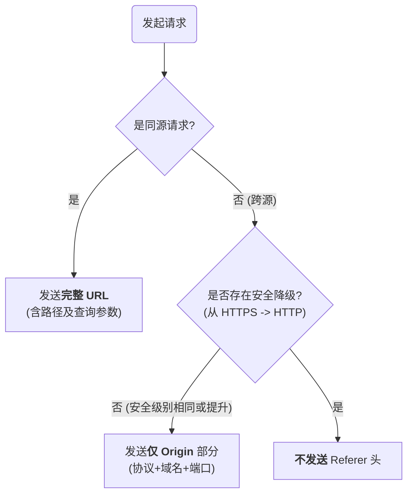

# `rel` 属性：保护新开页面的上下文安全

当使用 `target="_blank"` 在新标签页中打开链接时会打开一个新的页面，新页面可以通过 `window.opener` 属性访问并操作源页面。这带来了被称为“**反向 tabnabbing**”的安全风险，即恶意页面可能通过 `window.opener.location = '...'` 将源页面重定向至一个仿冒的钓鱼网站。`noopener` 和 `noreferrer` 属性正是为了规避此风险。

- **`rel="noopener"`**：指示浏览器在打开新页面时，将新页面的 `window.opener` 属性设置为 `null`，从而切断新旧页面之间的联系。这是防御“反向 tabnabbing”攻击的直接手段。
- **`rel="noreferrer"`**：该属性更为严格，它包含了 `noopener` 的全部功能，同时还会指示浏览器在向新页面发起请求时，**完全省略 `Referer` HTTP 头**。目的是为了在保障安全的同时，进一步增强用户隐私，不向目标网站透露用户是从哪个页面链接过去的。

> [!tip] 现代浏览器实践
> 为提升 Web 的整体安全性，所有现代浏览器（Chrome, Firefox, Safari, Edge等）在处理 `target="_blank"` 的链接时，现在都会**隐式地应用 `noopener` 的行为**，即使开发者没有显式声明 `rel="noopener"`。

# `Referrer-Policy`：精细化控制来源信息的发送

`Referer` HTTP 请求头用于告知服务器当前请求的来源页面 URL。然而，在 URL 中可能包含用户的敏感信息（如路径、查询参数），因此精确控制 `Referer` 的发送策略至关重要。`Referrer-Policy` 允许我们通过 HTTP 响应头或 HTML `<meta>` 标签来定义这一策略。

当前所有现代浏览器的**默认策略**是 **`strict-origin-when-cross-origin`**。其决策流程可以被可视化为：

这个默认值在功能、隐私和安全之间取得了极佳的平衡。除此之外，我们还可以选择其他七种策略以满足不同的需求。

| 策略 (Policy)                                 | 同源 (Same-Origin) | 跨源（安全→安全） HTTP → HTTPS 或 HTTPS → HTTPS | 跨源（安全→降级） HTTPS → HTTP | 说明                               |
| ------------------------------------------- | ---------------- | ----------------------------------------- | ------------------------- | -------------------------------- |
| `no-referrer`                               | ❌ 不发送            | ❌ 不发送                                     | ❌ 不发送                     | ✔️ 完全禁用 Referrer。                |
| `no-referrer-when-downgrade` (旧默认)          | ✅ 完整 URL         | ✅ 完整 URL                                  | ❌ 不发送                     | ✔️ 跨源允许，只是不允许降级。曾是 Chrome 的默认策略。 |
| `origin`                                    | ✅ 仅 origin       | ✅ 仅 origin                                | ✅ 仅 origin                | ✔️ 不含路径，适合基本来源跟踪。                |
| `origin-when-cross-origin`                  | ✅ 完整 URL         | ✅ 仅 origin                                | ✅ 仅 origin                | ✔️ 在同源下完整，跨源仅 origin。            |
| `same-origin`                               | ✅ 完整 URL         | ❌ 不发送                                     | ❌ 不发送                     | ✔️ 只发送给同源，隐私性好，限制严格。             |
| `strict-origin`                             | ✅ 仅 origin       | ✅ 仅 origin                                | ❌ 不发送                     | ✔️ 严格限制降级场景，保证隐私。                |
| `strict-origin-when-cross-origin` (**新默认**) | ✅ 完整 URL         | ✅ 仅 origin                                | ❌ 不发送                     | ✔️ 现代浏览器默认值（如 Chrome），推荐策略。      |
| `unsafe-url`                                | ✅ 完整 URL         | ✅ 完整 URL                                  | ✅ 完整 URL                  | ⚠️ 始终发送完整 URL，不推荐，泄露风险大。         |

> [!note] 名词解析
> - **完整 URL (Full URL)**: 指包含协议、域名、端口、路径和查询参数的完整地址。
> - **仅 Origin (Origin Only)**: 指仅包含协议、域名和端口的部分，不含路径和查询参数。
> - **`unsafe-url` 的“不安全”**: 指的是它会在任何情况下（包括不安全的 HTTP 请求）都暴露可能包含敏感信息的完整路径和查询参数。

