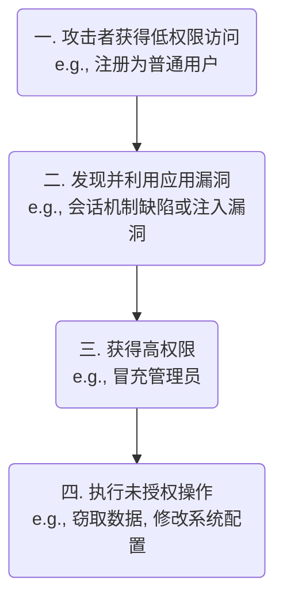

# 权限提升 (Privilege Escalation) 的概念

权限提升是许多复杂攻击的最终目标。攻击者利用一系列技术手段，打破应用预设的权限边界，获得其本不应拥有的能力。



# 攻击向量一：会话劫持 (Session Hijacking)

会话劫持的核心在于**冒充用户身份**。Web 应用通过一个称为 `Session ID` 的唯一标识符（通常存储在 Cookie 中）来识别已认证的用户。如果攻击者能够窃取或伪造一个合法用户的 `Session ID`，他们就可以向服务器冒充该用户，从而继承其所有权限。

> [!note] 会话标识的获取途径
> 攻击者获取 `Session ID` 的常见途径包括：
> - **XSS (跨站脚本攻击)**: 通过在页面注入脚本，直接读取 `document.cookie` 来窃取。
> - **MITM (中间人攻击)**: 在不安全的 HTTP 连接中，直接从网络流量中嗅探到 Cookie。
> - **会话固定 (Session Fixation)**: 在用户登录前，强制用户使用一个由攻击者指定的 `Session ID`。
> - **可预测的 Session ID**: 如果 `Session ID` 的生成规律过于简单，攻击者可能通过暴力破解或预测来猜出合法的 `Session ID`。

**核心防御策略**：**保护 `Session ID` 的机密性、完整性和不可预测性**。

- **使用安全的 Cookie 属性**: 为 `Session ID` 所在的 Cookie 设置 `HttpOnly` 标志（防止 XSS 读取）、`Secure` 标志（强制仅通过 HTTPS 传输）以及 `SameSite=Strict` 或 `Lax`（防御 CSRF）。
- **会话管理最佳实践**:
    - 在用户登录成功后，立即重新生成一个新的 `Session ID`。
    - 为会话设置合理的过期时间。
    - 使用加密强度高的随机数生成器来创建 `Session ID`。

# 攻击向量二：注入攻击 (Injection Attacks)

注入攻击是一大类漏洞的总称，其共同点是：**攻击者将不可信的数据发送给应用程序，而应用程序在未进行充分验证和净化的情况下，将这些数据作为命令或查询的一部分进行了解析和执行**。

## SQL 注入 (SQL Injection)

- **机制**: 当应用程序使用字符串拼接的方式构建 SQL 查询语句时，攻击者可以通过在输入字段中填入恶意的 SQL 代码片段，来改变原始查询的逻辑。
- **示例**: `OR 1=1` 永远为真，而 `--` 注释掉了后续的查询，导致密码验证被完全绕过。

```sql
-- 原始、不安全的代码逻辑
"SELECT * FROM users WHERE username = '" + username + "' AND password = '" + password + "'";

-- 攻击者在 password 字段输入: ' OR 1=1 --
-- 最终执行的 SQL:
"SELECT * FROM users WHERE username = 'some_user' AND password = '' OR 1=1 --'"
```

> [!warning] 防御 SQL 注入
> - **预编译语句 (Prepared Statements)** 与**参数化查询 (Parameterized Queries)**: 这是防御 SQL 注入的**唯一标准方法**。它将 SQL 命令的结构与用户输入的数据完全分离，确保用户输入永远只被当作数据处理，而不是可执行代码。
> - **使用 ORM (Object-Relational Mapping)**: 像 Sequelize, TypeORM 等库通常默认使用参数化查询，能有效避免此类问题。
> ```js
> // Node.js 中使用 mysql2 库的参数化查询
> db.query(
>   'SELECT * FROM users WHERE username = ? AND password = ?',
>   [username, password] // 用户输入被安全地作为数据传递
> );
> ```

## 命令注入 (Command Injection)

- **机制**: 当应用程序需要调用操作系统级别的命令（如 `ping`, `ls`, `curl`），并且将用户输入作为这些命令的参数时，攻击者可以输入额外的命令，由操作系统一并执行。
- **防御**:
    - **避免系统命令调用**: 尽可能使用语言内置的、更安全的 API 来替代直接调用操作系统命令。
    - **严格的输入净化**: 对用户输入进行严格的“白名单”验证，只允许已知安全的字符和格式。

## 参数注入 / 批量赋值 (Parameter Injection / Mass Assignment)

- **机制**:
    1. **篡改表单**: 攻击者通过浏览器开发者工具，修改前端表单中被禁用的字段（如 `role` 字段），或添加新的字段（如 `isAdmin: true`），并提交给服务器。
    2. **不安全的后端处理**: 后端代码在接收到请求后，未经验证就将请求体中的所有参数直接批量地更新到数据库模型中。
- **防御**: 后端必须**永远不要**信任来自客户端的参数列表。应使用 DTO (Data Transfer Object) 或“白名单”模式，只允许特定的、可被当前用户修改的字段被更新。

## 文件上传漏洞 (File Upload Vulnerabilities)

- **机制**: 当应用程序对用户上传的文件类型、大小或内容缺乏严格的验证时，攻击者可以上传恶意文件，如一个伪装成图片的病毒 `.exe` 文件，或一个包含可执行代码的 Web Shell 脚本 (`.php`, `.jsp`)。
- **防御**:
    - 在服务器端严格验证文件的 **MIME 类型**和**文件头**，而不仅仅是文件扩展名。
    - 对上传的文件进行重命名，使用不可预测的文件名。
    - 将上传的文件存储在 Web 应用根目录之外的一个隔离目录中。
    - 通过一个安全的端点来提供文件访问，并设置正确的 `Content-Type` 响应头。

## 远程代码执行 (Remote Code Execution, RCE)

- **机制**: 这是最严重的漏洞之一。攻击者利用应用程序的漏洞（如不安全的反序列化、严重的命令注入或文件上传漏洞），在目标服务器上执行任意代码。
- **防御**: 避免在代码中使用能够动态执行字符串的函数，如 `eval()`, `new Function()`, `exec()` 等，尤其是在处理用户可控的输入时。

