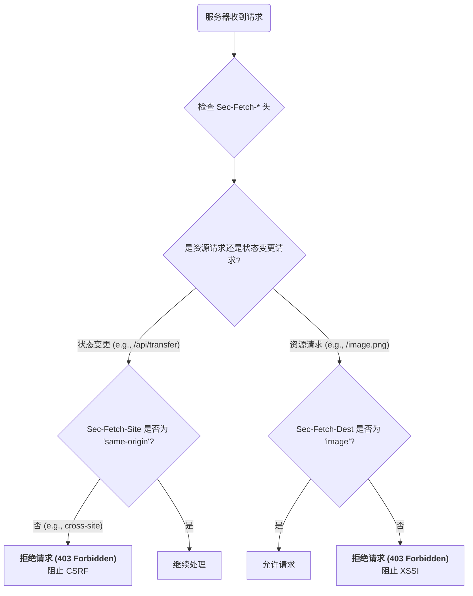

在传统的 Web 安全模型中，服务器在处理一个 HTTP 请求时，很难判断该请求的真实“上下文”：它是由本站点的 JavaScript 发起的，还是由一个恶意网站上的 `` 标签触发的？这种上下文的缺失是 CSRF、跨站脚本包含 (XSSI) 等多种攻击的根源。**获取元数据请求头 (Fetch Metadata Request Headers)** 是一套由浏览器自动添加、以 `Sec-` 开头的 HTTP 请求头，它向服务器提供了关于一个请求来源的、**由浏览器保证其真实性**的结构化信息。这使得服务器能够基于请求的真实上下文，实施更精细、更强大的安全策略。

# `Sec-Fetch-*` 头部详解

这组请求头由浏览器自动附加到请求中，并且被定义为“禁止修改的请求头 (forbidden header names)”，这意味着客户端 JavaScript 代码**无法**通过 `fetch()` 或 `XMLHttpRequest` 等 API 来修改它们，从而保证了其可信度。

## `Sec-Fetch-Site`: 请求的站点关系

此头部用于标识请求发起方与目标服务器之间的站点关系。

- **`cross-site`**: 请求由不同的站点发起。例如，从 `evil.com` 向 `my-bank.com` 发起的请求。
- **`same-site`**: 请求由同一个站点，但不同的源发起。例如，从 `login.example.com` 向 `api.example.com` 发起的请求。
- **`same-origin`**: 请求完全是同源的。例如，从 `https://app.example.com` 向 `https://app.example.com/api` 发起的请求。
- **`none`**: 请求并非由某个网站发起，而是源于用户的直接交互，例如在地址栏输入 URL、点击书签、将文件拖入浏览器等。

## `Sec-Fetch-Mode`: 请求的模式

此头部描述了请求的“模式”，即浏览器在何种情境下发起了这个请求。

- **`cors`**: 这是一个跨源请求，遵循 CORS (跨源资源共享) 协议。典型的例子是 `fetch()` 一个跨域 API。
- **`navigate`**: 这是一个顶层导航请求，例如用户点击链接、刷新页面或在地址栏输入地址。
- **`no-cors`**: 这是一个不遵循 CORS 协议的跨源请求，例如请求一张 `` 或加载一个 `<script>`。这类请求的响应体通常对 JavaScript 不可读。
- **`same-origin`**: 这是一个同源请求。
- **`websocket`**: 这是一个 WebSocket 握手请求。

## `Sec-Fetch-Dest`: 请求的目的地

此头部描述了请求所要获取的资源的“目的地”或类型。

- **`document`**: 顶层导航请求，目标是一个 HTML 文档。
- **`iframe`**: 导航请求，目标是一个 `<iframe>` 或 `<frame>`。
- **`image`**: 目标是图片资源，由 `` 标签、`background-image` 等触发。
- **`script`**: `script` 标签或 `importScripts` 触发的脚本请求。
- **`worker`**: `new Worker()` 或 `new SharedWorker()` 触发的 Worker 脚本请求。
- **`empty`**: 由 `fetch()` 或 `XMLHttpRequest` 发起的、目的地类型不明确的请求。

## `Sec-Fetch-User`: 用户是否触发

这是一个布尔值（以 `?1` 表示 `true`），用于指示一个**导航请求**是否由用户的**激活行为**（如点击）触发。

- **`?1`**: 请求是由用户交互直接触发的。
- **(不存在此头部)**: 请求不是由用户激活的导航。

# 安全实践：利用 Fetch Metadata 防御攻击

这些头部的组合为服务器提供了一幅关于请求来源的清晰画像，使其能够轻松识别并拒绝非预期的请求。



## 示例：防御 CSRF 攻击

一个经典的 CSRF 攻击是利用 `` 标签从恶意网站向目标网站发起一个 `GET` 请求以执行恶意操作。在没有 Fetch Metadata 的情况下，服务器很难区分这个请求。

> [!example] CSRF 攻击请求与防御
> 假设攻击者在 `evil.com` 页面上放置了 ``。**浏览器发送的请求头将包含**:
> ```http
> GET /transfer?amount=1000 HTTP/1.1
> Host: my-bank.com
> Cookie: session=...
> Sec-Fetch-Site: cross-site
> Sec-Fetch-Mode: no-cors
> Sec-Fetch-Dest: image
> ```
> **服务器端的防御逻辑 (Node. Js/Express 伪代码)**:
> ```js
> app.post('/transfer', (req, res) => {
>   // 获取 Sec-Fetch-Site 头
>   const site = req.headers['sec-fetch-site'];
>   // 仅允许来自本站的请求 
>   if (site === 'same-origin' || site === 'same-site') {
>      // ... 执行转账逻辑 
>      res.send('Transfer successful.'); 
>    } else { 
>      // 拒绝所有跨站请求，有效阻止 CSRF 
>      res.status(403).send('Cross-site request to this endpoint is forbidden.'); 
>    }
> });
> ```

