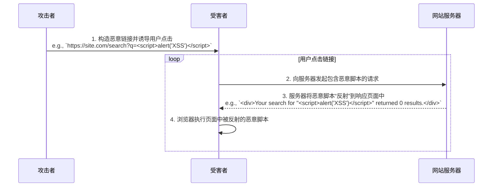
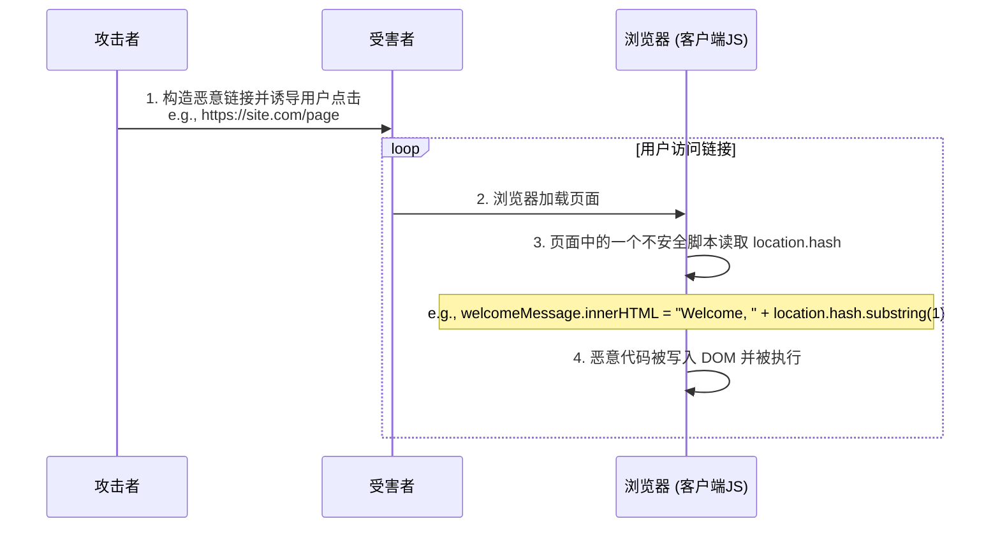
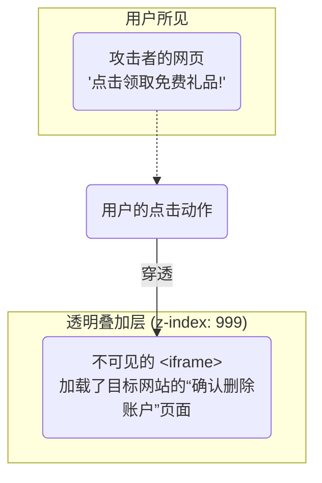

# XSS (Cross-Site Scripting)：跨站脚本攻击

XSS 攻击的核心是**恶意代码注入**。攻击者通过利用网站对用户输入的信任和未进行充分过滤的漏洞，将恶意的脚本（通常是 JavaScript）注入到网页的 HTML 或 DOM 中。当其他用户访问该页面时，浏览器会毫无防备地执行这些恶意脚本，从而导致如会话劫持（窃取 Cookie）、页面篡改、数据窃取等一系列恶意行为。

XSS 根据恶意脚本的注入和执行方式，主要分为以下三种类型。

1. **存储型 XSS (Stored XSS)**：攻击者将恶意脚本提交并**永久存储**在目标网站的服务器上（例如，数据库中的一条评论、一篇帖子）。当任何用户请求包含此恶意数据的内容时，服务器会将其与正常内容一起返回，导致恶意脚本在用户浏览器中执行。一个典型的存储型 XSS 攻击流程如下：

2. **反射型 XSS (Reflected XSS)**：这种攻击是**非持久性**的。恶意脚本作为请求 URL 的一部分（例如，查询参数）被发送到服务器，服务器在未经验证和编码的情况下，将该脚本 **“反射”** 回响应的 HTML 中。攻击者通常需要诱导用户点击一个特制的恶意链接来触发攻击。

3. **基于 DOM 的 XSS (DOM-based XSS)**：这是一种更隐蔽的客户端攻击。其注入和执行**完全发生在浏览器端**，服务器可能完全不知情。攻击者利用不安全的客户端 JavaScript 代码，这些代码从一个可控的来源（如 `location.hash`、`document.referrer`）读取数据，并在未充分净化的情况下，通过 `innerHTML`、`document.write()` 等方法将其写入当前页面的 DOM 中，从而导致脚本执行。

**核心防御策略**：

- **输入验证与输出编码**：
    - **输入验证**: 在接收用户输入时，遵循“白名单”原则，仅接受符合预设格式的数据。
    - **输出编码 (最重要的防御手段)**: 在将任何动态数据插入到 HTML 中之前，必须对其进行**上下文相关的编码**。例如，将 `<` 转换为 `&lt;`，`>` 转换为 `&gt;`，以确保浏览器将其作为纯文本对待，而不是可执行代码。应使用成熟的库（如 `DOMPurify`）来处理此过程。
- **内容安全策略 (Content Security Policy, CSP)**：通过设置 `Content-Security-Policy` HTTP 头，可以严格限制页面只允许从可信的来源加载和执行脚本。这是缓解 XSS 影响的强大纵深防御措施。
- **HttpOnly Cookie**：为 Session Cookie 设置 `HttpOnly` 标志，可以防止它被客户端 JavaScript 访问，即使 XSS 攻击成功，攻击者也无法通过脚本窃取到这个关键的 Cookie。

# CSRF (Cross-Site Request Forgery)：跨站请求伪造

CSRF 攻击的核心是**利用用户的身份，发送非本意的请求**。攻击者利用用户在目标网站（如银行网站）上已认证的会话（即浏览器中存有有效 Cookie），通过在另一个恶意网站上设置陷阱，诱导用户的浏览器向目标网站发送伪造的、会改变状态的请求（如转账、修改密码）。由于浏览器在发送请求时会自动携带目标域的 Cookie，这些伪造的请求在服务器看来是完全合法的。

```mermaid
sequenceDiagram
    participant Victim as 受害者
    participant AttackerSite as 攻击者的网站 (evil.com)
    participant TargetSite as 目标网站 (bank.com)

    Victim->>TargetSite: 1. 正常登录 bank.com, 浏览器存有 Cookie
    
    loop 之后
        Victim->>AttackerSite: 2. 被诱导访问 evil.com
        AttackerSite-->>Victim: 3. 页面中包含一个自动提交的表单<br/>`<form action="https://bank.com/transfer" method="POST">`
        Victim->>TargetSite: 4. 浏览器携带 bank.com 的 Cookie, 自动发送转账请求
        TargetSite->>TargetSite: 5. 服务器验证 Cookie, 认为请求合法, 执行转账
    end
```

**核心防御策略**：

- **反 CSRF 令牌 (Anti-CSRF Token)**：这是最核心、最有效的防御手段。服务器为每个用户会话生成一个不可预测的随机令牌，并将其嵌入到表单中。当提交表单时，必须同时提交这个令牌。服务器在接收到请求后，会验证该令牌是否匹配，从而确保请求是由真实的用户界面发起的。
- **SameSite Cookie 属性**：将会话 Cookie 设置为 `SameSite=Strict` 或 `SameSite=Lax`（现代浏览器默认值）。这会指示浏览器在跨站请求中**不发送**该 Cookie，从而从根本上阻止了 CSRF 攻击。
- **验证 `Origin` 或 `Referer` 头**：在服务器端检查 HTTP 请求的 `Origin` 或 `Referer` 头，确保请求来自可信的源。这可以作为一种辅助的防御手段。

# UI Redressing (Clickjacking)：点击劫持

UI Redressing，更广为人知的名字是**点击劫持 (Clickjacking)**。其核心是**视觉欺骗**。攻击者创建一个自己的网页，然后使用一个透明的 `<iframe>` 将目标网站的页面覆盖在上面。通过精心设计，将目标网站上的关键操作按钮（如“删除账户”、“确认支付”）精确地对准到攻击者网站上一个看似无害的按钮（如“播放视频”、“领取奖励”）下方。当用户以为自己在点击无害按钮时，实际上点击的是透明 `<iframe>` 中的危险按钮。

**核心防御策略**：

- **`X-Frame-Options` HTTP 头**:
    - 这是一个较早的、用于控制页面是否能被嵌入 `<iframe>` 的响应头。
    - `DENY`: 完全禁止页面被嵌入。
    - `SAMEORIGIN`: 只允许被同源的页面嵌入。
- **`Content-Security-Policy: frame-ancestors` (推荐)**:
    - 这是 `X-Frame-Options` 的现代替代品，功能更强大、更灵活。
    - `frame-ancestors 'self'`: 效果同 `SAMEORIGIN`。
    - `frame-ancestors 'none'`: 效果同 `DENY`。
    - 还可以指定允许嵌入的特定源。

# MITM (Man-in-the-Middle Attack)：中间人攻击

这是一种网络层的**窃听和篡改攻击**。攻击者将自己置于用户与服务器的通信链路之间，并与通信的两端分别建立独立的连接。攻击者可以拦截、读取、甚至修改双方交换的所有数据，而通信双方却误以为它们之间仍在进行直接的、私密的对话。

**核心防御策略**：**全站 HTTPS (HTTP Strict Transport Security)**

- 这是防御 MITM 的根本。HTTPS (HTTP over TLS/SSL) 通过加密确保了通信内容的**机密性**（中间人无法读取）和**完整性**（中间人无法篡改），并通过证书机制确保了服务器身份的**真实性**（中间人无法冒充）。
- 配合 **HSTS (HTTP Strict Transport Security)** 响应头，可以强制浏览器始终使用 HTTPS 访问网站，防止 SSL 剥离等降级攻击。