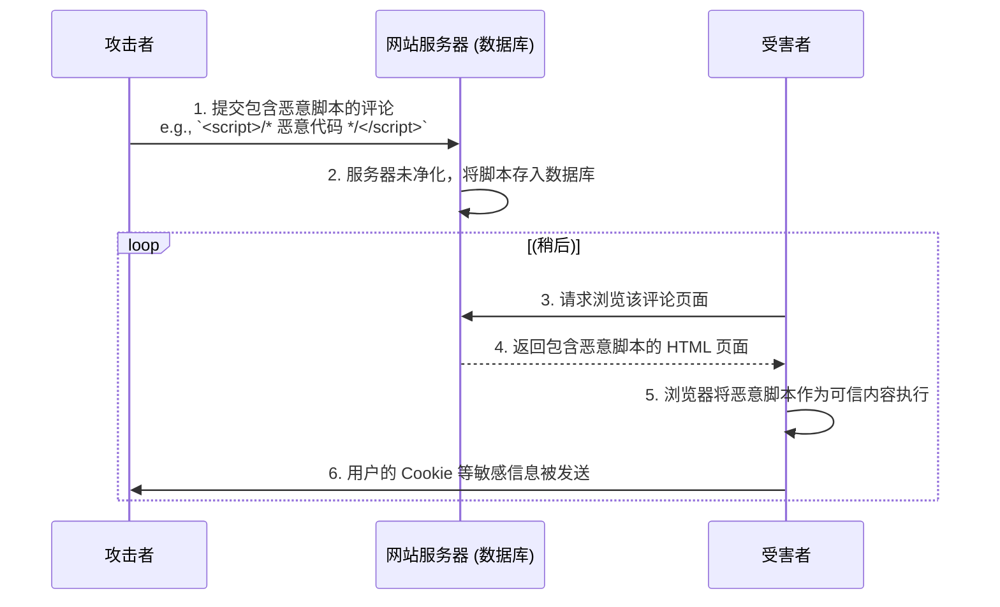
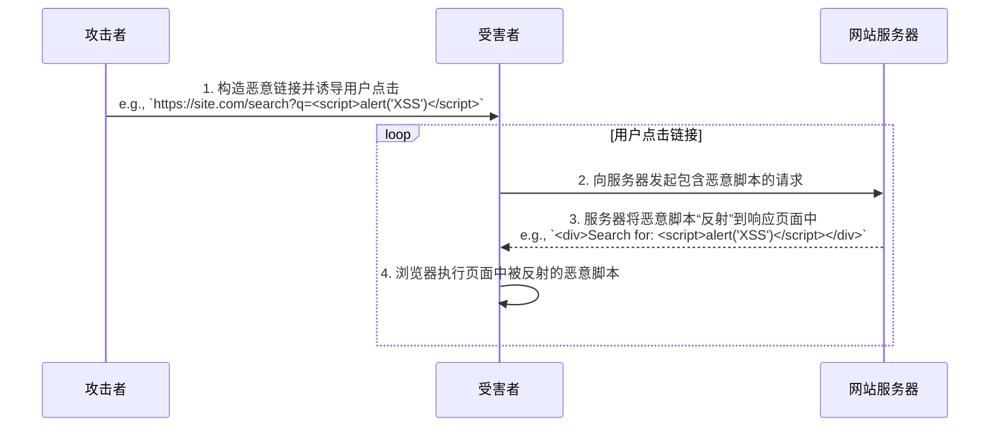
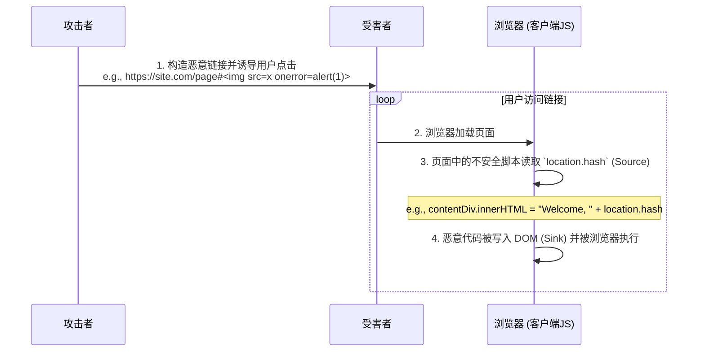

**跨站脚本攻击 (Cross-Site Scripting, XSS)** 是 Web 应用中最普遍、最具危害性的安全漏洞之一。其攻击的核心在于**恶意代码注入**：攻击者利用 Web 应用程序对用户输入的信任，在未进行充分验证或编码的情况下，将恶意的客户端脚本（通常是 JavaScript）注入到网页中。当其他用户浏览该网页时，其浏览器会毫无防备地将这些恶意脚本作为可信内容执行，从而导致会话劫持、数据窃取、页面篡改等严重后果。

> [!note] 关于缩写
> Cross-Site Scripting 的缩写本应为 “CSS”，但为了避免与层叠样式表 (Cascading Style Sheets, CSS) 的缩写混淆，安全领域约定俗成地使用 “XSS” 作为其代称。

# XSS 的分类与攻击向量

XSS 攻击根据恶意脚本的注入和执行方式，主要分为以下三种类型。

## 存储型 XSS (Stored XSS)

存储型 XSS 是危害最严重的一种。攻击者将恶意脚本提交并**永久性地存储**在目标网站的服务器端（例如，数据库、文件系统）。当任何用户请求包含此恶意数据的内容时，服务器会将其与正常内容一起返回，导致恶意脚本在每一个访问该页面的用户浏览器中执行。



## 反射型 XSS (Reflected XSS)

这种攻击是**非持久性**的。恶意脚本作为请求 URL 的一部分（例如，查询参数）被发送到服务器，服务器在未经验证和编码的情况下，将该脚本 **“反射”** 回响应的 HTML 中。攻击者通常需要通过钓鱼邮件、社交网络等方式，诱导用户点击一个特制的恶意链接来触发攻击。



## 基于 DOM 的 XSS (DOM-based XSS)

这是一种更隐蔽的客户端攻击，其注入和执行**完全发生在浏览器端**，服务器可能完全感知不到。该漏洞存在于页面的前端 JavaScript 脚本中：当脚本从**攻击者可控的来源**（如 `location.hash` —— 即 URL 中 `#` 后面的部分）读取数据，并在**未经过充分净化**的情况下，借助高风险的 DOM API（如 `innerHTML`）将数据写入页面时，恶意代码便可能被执行。


# 核心防御策略：纵深防御 (Defense in Depth)

防御 XSS 需要采取多层次的纵深防御策略，而不是依赖单一的解决方案。

## 输入验证 (Input Validation)

作为第一道防线，应用程序应在接收用户输入时，依据“白名单 (allow-list)”原则进行严格的验证，拒绝任何不符合预期格式的数据。

> [!warning] 输入验证的局限性
> 输入验证对于防止 XSS 是**必要但绝不充分**的。攻击者总能找到方法绕过验证规则。因此，**决不能**将输入验证作为唯一的防御手段。

## 输出编码 (Output Encoding)

这是**防御 XSS 最核心、最有效的手段**。其原则是，在将任何不可信数据插入到 HTML 文档之前，必须对其进行**上下文相关的编码 (Context-Sensitive Encoding)**，以确保浏览器始终将其作为纯文本数据对待，而非可执行代码。

- **HTML 上下文**: 将 `<` 转换为 `&lt;`，`>` 转换为 `&gt;`，`"` 转换为 `&quot;` 等。
- **JavaScript 上下文**: 当插入到 JavaScript 字符串中时，需要对引号、反斜杠、换行符等进行转义，以防用户输入突破字符串边界并注入代码。

> [!example] 安全的 DOM 更新
> 应始终避免使用 `innerHTML`, `outerHTML`, `document.write()` 等能直接解析 HTML 的 API 来插入不可信数据。应优先使用更安全的 API。
> ```js
> // 不安全: 易受 XSS 攻击
> const unsafeDiv = document.getElementById('unsafe');
> const userInput = '';
> unsafeDiv.innerHTML = userInput; // 恶意脚本会被执行
> 
> // 安全: 浏览器不会解析其中的 HTML
> const safeDiv = document.getElementById('safe'); 
> safeDiv.textContent = userInput; // 页面会如实显示字符串 ""
> 
> // 对于必须插入富文本的场景，应使用 `DOMPurify` 等成熟的库来对 HTML 进行严格的净化。
> ```

## 内容安全策略 (Content Security Policy, CSP)

CSP 是一种强大的、由浏览器强制执行的安全层。通过 `Content-Security-Policy` HTTP 响应头，可以精确地定义一个“白名单”，告诉浏览器只允许从哪些可信的源加载和执行脚本。一个配置良好的 CSP 可以在即使 XSS 注入成功的情况下，有效阻止恶意脚本的执行，作为一道重要的纵深防御。

## HttpOnly Cookie

为包含会话标识等敏感信息的 Cookie 设置 `HttpOnly` 标志，可以禁止客户端 JavaScript 通过 `document.cookie` API 访问它。这可以有效地防止 XSS 攻击成功后，攻击者通过脚本窃取用户会话 Cookie 来进行会话劫持。