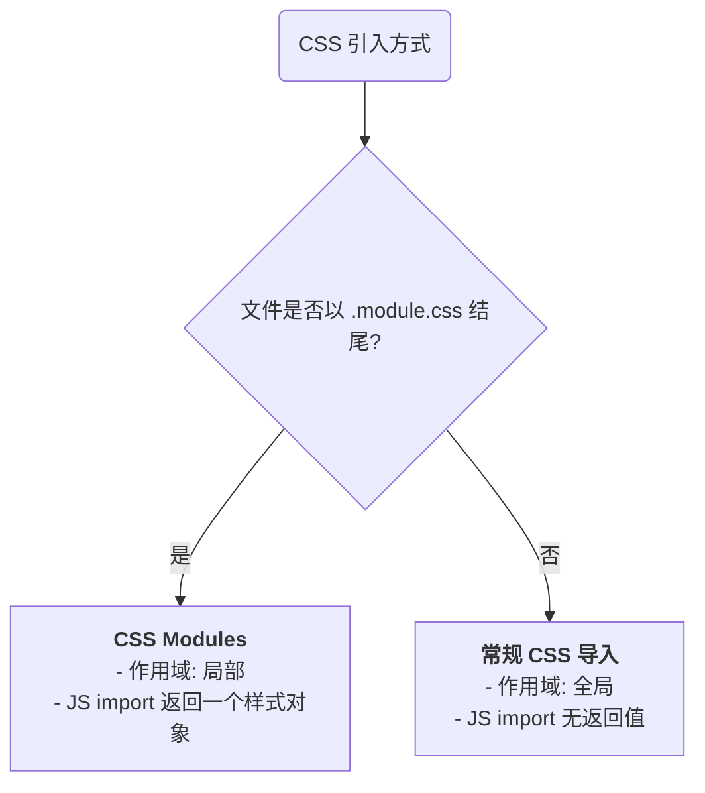

Vite 作为一个现代化的前端构建工具，其核心设计理念之一便是将 **CSS 视为模块图 (module graph) 的一等公民**。这意味着 CSS 的引入、处理和打包与 JavaScript 模块享有同等的地位和能力。Vite 不仅提供了多种引入样式的方式，还为现代 CSS 开发中至关重要的局部作用域、预处理器和后处理器提供了开箱即用、近乎零配置的支持。本笔记旨在深入解析 Vite 的 CSS 处理机制，涵盖其作用域管理、工具集成等核心工程实践。

# CSS 的引入与作用域

Vite 提供了三种主要方式来引入 CSS 文件，它们在作用域和行为上有所不同。

## `<link>` 标签引入

这是浏览器原生的、最经典的 CSS 引入方式。

```html
<head>
  <link rel="stylesheet" href="/src/styles/global.css" />
</head>
```

- **行为**: 遵循标准的浏览器加载和解析流程。
- **作用域**: **全局作用域**。`global.css` 中的所有样式规则都会应用到整个应用程序。

## JavaScript `import` 语句

在 Vite 中，可以直接在 JavaScript 或 TypeScript 文件中像导入模块一样导入 CSS 文件。

```js
// main.js
import './styles/global.css';
```

- **行为**: 这是在 Vite 项目中处理**全局样式**的推荐方式。
    - **开发环境**: Vite 开发服务器在接收到此 `import` 后，会通过 HMR (Hot Module Replacement) 机制，将 CSS 内容动态地以 `<style>` 标签的形式注入到页面的 `<head>` 中，实现即时更新。
    - **生产环境**: 在构建时，Vite (通过 Rollup) 会将所有通过此方式导入的 CSS 文件进行打包、压缩，并通常生成一个单一的 `.css` 文件，通过 `<link>` 标签在最终的 `index.html` 中引入。
- **作用域**: **全局作用域**。

> [!tip] 动态导入与 CSS 代码分割
> `import` 语法与 JavaScript 的动态导入 `import()` 结合使用时，可以实现 CSS 的**按需加载**。
> ```js
> // component.js
> button.addEventListener('click', () => {
>   // 仅在用户点击按钮后，才会加载并应用 heavy-component.css
>   import('./styles/heavy-component.css'); 
> });
> ```

## CSS Modules (局部作用域)

为了从根本上解决 CSS 全局命名冲突的问题，Vite 对 **CSS Modules** 提供了原生的、开箱即用的支持。

- **机制**: 只需将 CSS 文件命名为 `[name].module.css`（例如 `Button.module.css`），Vite 就会自动将其作为 CSS Module 来处理。
- **行为**: Vite 会将该文件中的所有类名进行哈希化，生成一个唯一的、不会与其他模块冲突的类名。同时，当你 `import` 这个文件时，它会返回一个包含了原始类名与哈希后类名映射关系的对象。
- **作用域**: **局部作用域**。样式被严格限制在导入它的那个组件或模块内部。



> [!example] CSS Modules 实践
> **`Button.module.css`**:
> ```css
> .button {
>   background-color: blue;
>   border-radius: 8px;
> }
> ```
> **`Button.jsx` (React 示例)**:
> ```js
> import styles from './Button.module.css';
> 
> export function Button() {
>   // styles.button 的值在运行时会是 "Button_button__a1B2c" 这样的唯一类名
>   return (
>     <div>Click me</div>
>   );
> }
> ```

# 集成的 CSS 工具

Vite 的另一大优势在于其对主流 CSS 生态工具的无缝集成。

## PostCSS

Vite **原生支持 PostCSS**，并且会自动应用在项目根目录下找到的 PostCSS 配置文件（如 `postcss.config.js`）。这意味着整合 Autoprefixer 等工具极其简单。

> [!note] PostCSS 配置流程
> 1. **安装依赖**: `npm install -D postcss autoprefixer`
> 2. **创建配置文件**: 在项目根目录创建 `postcss.config.js`。
> 3. **配置插件**:
> ```js
> // postcss.config.js
> export default {
>   plugins: {
>     'autoprefixer': {}, // 自动添加浏览器厂商前缀
>   },
> };
> ```
> Vite 会自动发现并应用此配置，无需在 `vite.config.js` 中进行任何额外设置。

## CSS 预处理器 (Pre-processors)

Vite 对 Sass/SCSS, Less, Stylus 等主流 CSS 预处理器也提供了开箱即用的支持。

- **机制**: Vite 会自动检测项目中是否安装了相应的预处理器依赖。
- **实践**: 无需任何配置。你只需要**安装对应的依赖包**，即可直接在你的组件中导入 `.scss`, `.less` 或 `.styl` 文件。

```bash
# 例如，要支持 Sass
npm install -D sass
```

```js
// App.jsx
import './styles/main.scss'; // 直接导入即可
```

