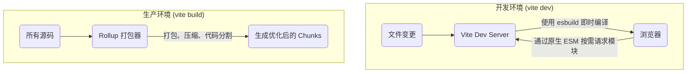

# Vite 的双重模式架构

Vite 的核心创新在于其区分开发与生产环境的混合构建模式。

## 开发环境：基于原生 ESM 与 `esbuild` 的即时服务

在开发阶段，Vite 启动一个开发服务器，该服务器直接将项目的源代码作为原生 ES 模块提供给浏览器。

- **原生 ESM**: 浏览器通过 `<script type="module">` 发起请求，Vite 开发服务器仅在浏览器请求相应模块时，才对其进行按需转换和提供。这避免了传统打包工具在启动时需要预先打包整个应用的巨大开销。
- **`esbuild` 的作用**: `esbuild`（由 Go 语言编写）在开发阶段扮演两个关键角色：
    1. **依赖预构建**: 快速将项目依赖的 CommonJS 模块转换为 ESM，并将多个内部模块的第三方库打包成单个模块，以提升后续页面加载性能。
    2. **即时编译**: 对 TypeScript、JSX 等非标准 JavaScript 文件进行极速的即时编译。

> [!tip] 开发体验的飞跃
> Vite 的开发模式实现了真正的按需编译，使得服务的冷启动速度和热更新 (Hot Module Replacement, HMR) 速度达到了毫秒级别，与传统打包工具动辄数秒甚至数十秒的等待时间形成了鲜明对比。

## 生产环境：基于 `Rollup` 的优化构建

尽管原生 ESM 在开发时表现出色，但在生产环境中，为了获得最佳的加载性能、进行代码压缩和实现对旧版浏览器的兼容，将模块进行**打包 (bundling)** 仍然是必要的。Vite 默认使用成熟且强大的 **Rollup** 来完成这一任务。



# Rollup 在 Vite 构建中的模块处理策略

在执行 `vite build` 命令时，Vite 会调用 Rollup。Rollup 会从应用的入口点开始，构建一个完整的**依赖图 (dependency graph)**，并基于模块的导入方式，智能地将代码组织成不同的**代码块 (chunks)**。

## 静态导入 (`import ... from ...`) 与依赖打包

当 Rollup 遇到标准的静态 `import` 语句时，它会认为这些模块是应用初始化时就必须存在的。

- **机制**: Rollup 会尽可能地将这些通过静态导入链接起来的模块，合并到同一个或少数几个主代码块中。
- **目的**: 这种策略旨在**减少生产环境中的 HTTP 请求次数**。将多个小模块合并成一个大文件，可以显著降低网络请求的开销，提升初始加载性能。

## 动态导入 (`import()`) 与代码分割

当 Rollup 遇到**动态 `import()`** 表达式时，它会将其视为一个明确的**代码分割点 (code-splitting point)**。

> [!note] 动态导入的语义
> `import()` 表达式本身返回一个 `Promise`，它向打包工具传递了一个清晰的信号：“这个模块不是立即需要的，它将在未来的某个时刻被按需加载。”

- **机制**: Rollup 会将动态导入的模块及其独有的依赖，打包到一个**独立的、异步加载的代码块**中。这个代码块只有在 `import()` 表达式被执行时，才会通过网络请求被加载。
- **目的**: 这是实现**按需加载 (lazy loading)** 的核心。通过将非首屏、低优先级或特定用户路径下才需要的代码（如路由组件、弹窗模块）进行代码分割，可以极大地减小初始加载包的体积，从而优化 FCP 和 LCP 等核心性能指标。

> [!example] 静态与动态导入的打包差异
> ```js
> // main.js
> // 静态导入：lodash-es 会被打包进主 chunk
> import { debounce } from 'lodash-es';
> 
> console.log('App started');
> 
> const btn = document.getElementById('my-btn');
> btn.addEventListener('click', () => {
>   // 动态导入：heavy-module.js 会被打包成一个独立的 chunk
>   import('./heavy-module.js').then(module => {
>   module.heavyFunction();
> });
> ```
> **Rollup 构建产物 (简化)**:
> - `dist/assets/index-a1b2c3.js` (主 chunk, 包含 `main.js` 和 `lodash-es` 的代码)
> - `dist/assets/heavy-module-d4e5f6.js` (异步 chunk, 包含 `heavy-module.js` 的代码)

# 未来展望：Rolldown

`Rolldown` 是 Vite 团队正在开发的、基于 Rust 的下一代打包工具。

- **目标**: 旨在用一个工具同时取代开发环境中的 `esbuild` 和生产环境中的 `Rollup`。
- **优势**:
    - **一致性**: 彻底消除开发环境与生产环境之间因打包器不同而可能产生的微小行为差异。
    - **性能**: 充分利用 Rust 语言带来的极致性能，实现开发和构建速度的全面提升。

`Rolldown` 的出现，预示着 Vite 将在保持其革命性开发体验的同时，进一步提升生产构建的效率和一致性。