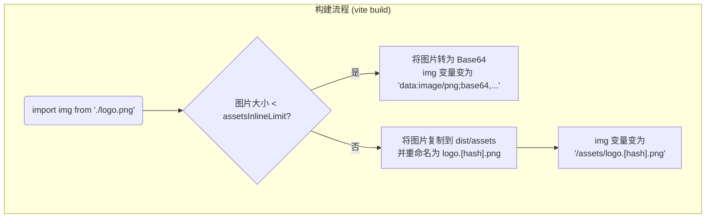

在现代前端工程化中，对静态资源（如图片、字体、JSON 文件等）的高效管理是决定应用性能和可维护性的关键一环。Vite 作为新一代构建工具，为此提供了两种截然不同但互为补充的处理模式：一种是通过 `public` 目录提供始终保持原样、未经处理的资源；另一种则是将资源作为模块图的一部分从 `src` 目录中导入，使其能够受益于 Vite 强大的构建优化管线。

# `public` 目录：未经处理的静态资源

每个 Vite 项目的根目录下都可以包含一个 `public` 目录。所有存放于此目录下的文件，在开发和构建阶段都会被完整地复制到输出目录的根路径下。

- **访问方式**: 文件会始终被部署在项目的根路径下，可以通过绝对路径直接访问。例如，`public/my-image.png` 在浏览器中可以通过 `http://localhost:5173/my-image.png` 访问。
- **自定义目录**: 可以在 `vite.config.js` 中通过 `publicDir` 选项来指定一个不同的目录。

```js
// vite.config.js
export default {
  publicDir: 'static', // 将 'static' 文件夹作为 public 目录
}
```

> [!note] `public` 目录的核心特性
> - **原样服务**: 文件**不会**经过 Vite 的任何转换、打包或优化处理。
> - **路径不变**: 文件名**不会**被哈希化，路径永远是可预测的。
> - **无模块导入**: 你**不能**在 JavaScript 代码中通过 `import` 来引用 `public` 目录下的文件以获取其 URL。

> [!warning] `public` 目录的适用场景与局限
> **适用场景**:
> - 需要保持特定文件名和路径的文件，如 `robots.txt`, `manifest.webmanifest`。
> - 不会被源码直接引用的、体积较大的资源。
> - 需要一个包含 `src` 属性的脚本，但该脚本无法被打包时。
> 
> **局限**: 由于文件未经处理且无哈希，当资源内容更新时，必须依赖服务器配置（如 ETag）进行缓存失效，否则用户可能无法获取到最新版本。

# 从 `src` 导入：作为模块的静态资源

这是在 Vite 中处理静态资源的**推荐方式**。将资源文件（如图片）放置在 `src` 目录中，并像导入 JS 模块一样在代码中引用它。

```js
import myImage from './assets/my-image.png';

document.getElementById('hero').src = myImage;
```

这种方式将静态资源无缝地融入了 Vite 的模块图中，使其能够受益于一系列强大的构建时优化。

## 核心优势：构建时优化

- **哈希化文件名**: 在生产构建时，Vite 会为资源文件生成一个包含哈希值的新文件名（例如 `my-image.a1b2c3d4.png`）。这使得可以为该资源配置**永久性的、强力的浏览器缓存**，而无需担心内容更新后的缓存失效问题（因为内容更新会导致哈希变化，从而生成新文件名）。
- **Base64 内联**: 对于小于特定大小 (由 `build.assetsInlineLimit` 选项控制，默认值为 4096 字节 (4 KB)) 的资源，Vite 会自动将其转换为 Base64 编码的 Data URL，并直接内联到 JavaScript 包中。这可以**减少不必要的 HTTP 请求**，尤其适用于小的图标和图片。



## `assetsInclude` 配置

如果需要将非标准的、自定义的文件类型（例如 `.glsl` 着色器文件）也作为资源模块进行处理，可以在 `vite.config.js` 中使用 `assetsInclude` 选项进行配置。

# 高级优化：`vite-imagetool`

对于图片资源，可以通过 `vite-imagetool` 等强大的社区插件，在导入时进行即时的、精细化的优化和转换。安装并配置插件后，可以在 `import` 语句的路径后附加查询参数，来动态地处理图片。

> [!example] 使用 `vite-imagetool` 进行动态图像转换
> ```js
> // 安装: npm install -D vite-imagetool
> 
> import React from 'react';
> 
> // 1. 为不同的现代格式 (avif, webp) 和传统格式 (jpg) 分别导入图片资源
> // vite-imagetool 会在构建时，根据查询参数生成对应的图片版本
> import avifSrc from './my-image.jpg?format=avif';
> import webpSrc from './my-image.jpg?format=webp';
> import jpgSrc from './my-image.jpg?format=jpg'; // 作为最终回退
> 
> // 导入元数据以获取图片的原始宽高比，用于防止布局偏移 (CLS)
> import imageMetadata from './my-image.jpg?as=metadata';
> 
> 
> function MyResponsiveImage() {
>   // 利用元数据设置 img 标签的 width 和 height 属性
>   const { width, height } = imageMetadata;
> 
>   return (
>     <picture>
>       {/* 浏览器会从上到下检查 source 标签 */}
>       
>       {/* 首先，尝试加载 AVIF 格式。如果浏览器支持 AVIF，就会使用这个源，并忽略后续所有 source */}
>       <source srcSet={avifSrc} type="image/avif" />
>       
>       {/* 如果浏览器不支持 AVIF，它会继续检查下一个。如果支持 WebP，就会使用这个源 */}
>       <source srcSet={webpSrc} type="image/webp" />
>       
>       {/* 最终的回退方案：所有现代格式都不支持时，使用传统的 JPG 格式 */}
>       {/* img 标签是必须的，既是回退，也承载了 alt, width, height 等核心属性 */}
>                src={jpgSrc} 
>         width={width} 
>         height={height} 
>         alt="A descriptive alt text for the image" 
>       />
>     </picture>
>   );
> }
> ```

